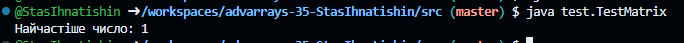

[](https://classroom.github.com/online_ide?assignment_repo_id=19505482&assignment_repo_type=AssignmentRepo)
# Практична робота "Поглиблене використання масивів"

## Опис завдання
Знайти в матриці розміром N x M число, яке повторюється найбільшу кількість разів

### Клас MatrixAnalyzer
Клас `MatrixAnalyzer` призначений для аналізу цілочисельної матриці розміром `N x M` з метою знаходження числа, що повторюється найчастіше.

- ✅ **Оптимізація памʼяті**: використано компактні типи даних (`int[][]` для матриці та `Map<Integer, Integer>` для підрахунку частот).
- ✅ **Сучасний підхід**: реалізація аналізу базується на функціональній обробці масивів через `Arrays.stream()` без використання явних циклів.
- ✅ **Чітке іменування**: змінні й константи названо згідно з Java Naming Conventions для кращої читабельності.
- ✅ **Javadoc-документація**: клас задокументовано для автоматичної генерації документації за допомогою утиліти `javadoc`.

#### Основний функціонал:
- Генерація тестової матриці.
- Вивід її у консоль.
- Пошук числа, яке зустрічається найчастіше, та його вивід.

#### Приклад використання:
```java
MatrixAnalyzer analyzer = new MatrixAnalyzer();
int[][] matrix = analyzer.generateMatrix(5, 6);
System.out.println("Matrix:");
analyzer.printMatrix(matrix);
int mostFrequent = analyzer.findMostFrequentNumber(matrix);
System.out.println("Most frequent number: " + mostFrequent);
```
### Клас TestMatrix

Клас `TestMatrix` є тестовим застосунком, який демонструє використання класу [`MatrixAnalyzer`](#matrixanalyzer) для аналізу матриці та пошуку найчастіше повторюваного числа.

#### Призначення:
- Запускає програму з готовою тестовою матрицею `3x3`.
- Викликає метод `findMostFrequentNumber(...)` зі статичного класу `MatrixAnalyzer`.
- Виводить у консоль результат аналізу — найчастіше число у матриці.

#### Приклад роботи:
